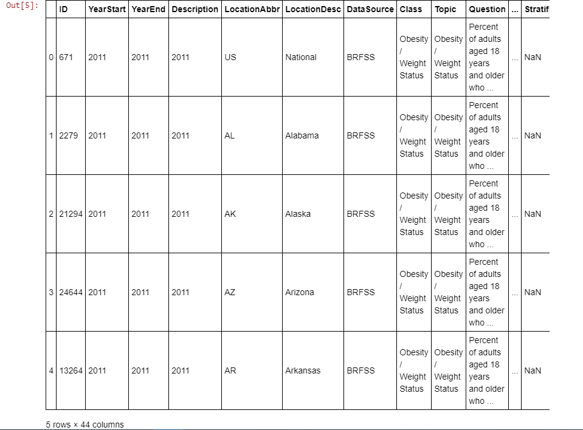
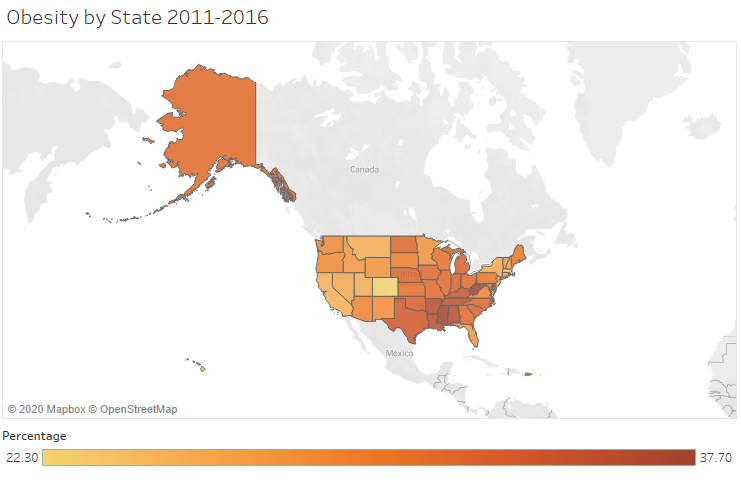

# Obesity and Diabetes in the US 2011-2016

<br>
Diabetes is a disease that occurs when your blood glucose, also called blood sugar, is too high. Blood glucose is your main source of energy and comes from the food you eat. Insulin, a hormone made by the pancreas, helps glucose from food get into your cells to be used for energy

## Research done to Answer the following questions:
* Has Diabetes % Increased in the US 
* Has Obesity % Increaed in the US
* What are the top 10 states with Diabetes/Obesity
* What are the bottom 10 states with Diabetes/Obesity
* Do States with higher Diabetes Rates  also have Higher Obesity Rates

## Technology used
* Anaconda 
* Jupyter NoteBook
* Python/Pandas
* Tableau

## Process
### Datasets
For Obesity dataset I used 6 difffent csv files from 2011-2016 downloaded from the CDC website\
For Diabetes dataset I used 6 diffrent csv files files from 2011-2016 downloaded from the CDC website

### 1. Data Cleaning
I used Jupyter Notebook to concate the difffent csv files into one csv file and data cleaning
```python
# Dependencies
import pandas as pd
from glob import glob

# use glob() to list all files that match a pattern 
obesity_files = sorted(glob('Resources/*-Obesity.csv'))
obesity_files
```


```python
# Concat all files  by using pd.concat() and asssign() methods
obesity_2011_to_2016 = pd.concat((pd.read_csv(file).assign(filename = file)
          for file in obesity_files), ignore_index = True)
obesity_2011_to_2016.head()
```



### 2. Visualization
I used Tableau to visualize my findings

Map of Diabetes & Obesity in 2016




[Tableau DashBoard](https://public.tableau.com/views/USADiabetesObesity2011-2016/Dashboard1?:display_count=y&publish=yes&:origin=viz_share_link)


### 3. Conclusion


